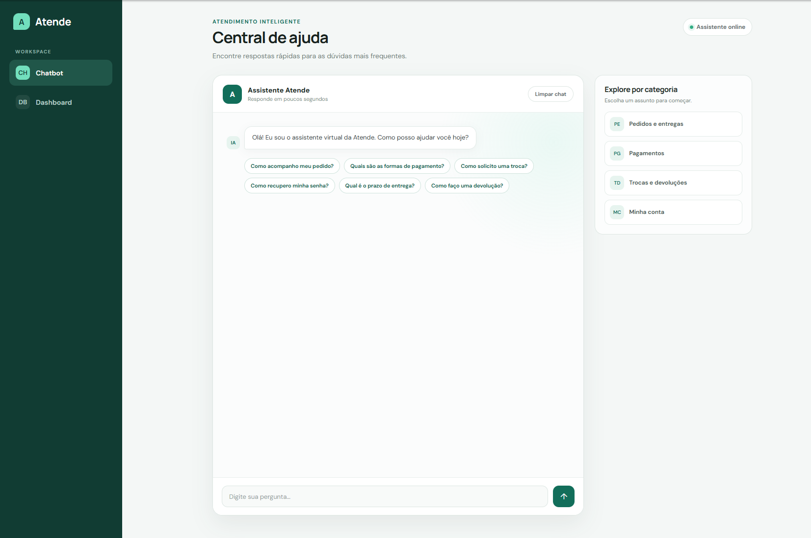
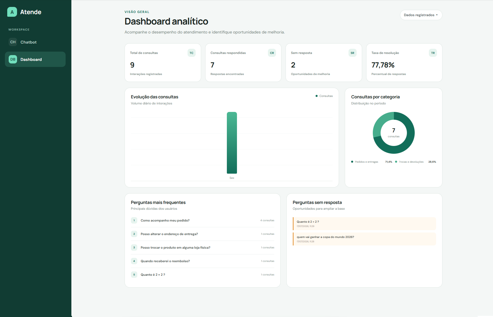
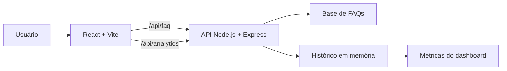

#  Chatbot de FAQ com Dashboard Analítico
> Chatbot de FAQ com dashboard analítico para automatizar respostas e transformar as interações em dados úteis.


## Sobre o projeto

## Demonstração

### Chatbot



### Dashboard analítico



O **desafio02-fullstack** é uma aplicação full stack dividida em dois módulos:

- **Chatbot:** encontra respostas em uma base de FAQs, sugere perguntas por categoria e registra consultas respondidas ou não respondidas.
- **Dashboard:** exibe total de consultas, taxa de resolução, perguntas frequentes, perguntas sem resposta, distribuição por categoria e evolução das interações.

O projeto também conta com layout responsivo, estados de carregamento e erro, API REST, testes automatizados e execução completa com Docker.

## Arquitetura



As interações ficam armazenadas **em memória**. Portanto, o histórico é reiniciado quando o backend é encerrado ou reiniciado. O seed existe para facilitar a demonstração do dashboard sem depender de um banco de dados.

## Tecnologias

| Camada | Tecnologias |
| --- | --- |
| Frontend | React 19, Vite 8, JavaScript, CSS e Fetch API |
| Backend | Node.js 24, Express 4, CORS e dotenv |
| Testes | Node Test Runner e `node:assert` |
| Infraestrutura | Docker, Docker Compose, Nginx e health checks |
| Organização | Monorepo com npm workspaces |

## Como rodar com Docker

Esta é a forma mais rápida de executar a aplicação completa.

### 1. Clone e acesse o projeto

```bash
git clone https://github.com/victormbm/desafio-full-stack02-chat-bot.git desafio02-fullstack
cd desafio02-fullstack
```

### 2. Crie o arquivo de ambiente

No PowerShell:

```powershell
Copy-Item .env.example .env
```

No Linux ou macOS:

```bash
cp .env.example .env
```

Configuração disponível:

```env
FRONTEND_PORT=8080
BACKEND_PORT=3001
SEED_DEV_DATA=false
```

Use `SEED_DEV_DATA=false` para iniciar com o dashboard vazio ou `SEED_DEV_DATA=true` para carregar dados simulados.

### 3. Suba os containers

```bash
docker compose up --build
```

Acesse:

- Aplicação: [http://localhost:8080](http://localhost:8080)
- API: [http://localhost:3001](http://localhost:3001)
- Health check: [http://localhost:3001/health](http://localhost:3001/health)

Para encerrar e remover os containers:

```bash
docker compose down
```

## Como rodar localmente

### Pré-requisitos

- Node.js 24 recomendado
- npm

### 1. Instale as dependências

Na raiz do projeto:

```bash
npm ci
```

### 2. Inicie o backend

Em um terminal:

```bash
npm run dev:backend
```

O backend ficará disponível em [http://localhost:3001](http://localhost:3001).

### 3. Inicie o frontend

Em outro terminal:

```bash
npm run dev:frontend
```

O frontend ficará disponível em [http://localhost:5173](http://localhost:5173). Durante o desenvolvimento, o Vite encaminha as chamadas de `/api` para o backend na porta `3001`.

## Dados de demonstração

O Dashboard oferece duas formas de visualização:

- **Dados registrados:** apresenta métricas calculadas a partir das interações reais realizadas no Chatbot.
- **Dados demonstrativos:** exibe uma semana completa com dados fixos e determinísticos, permitindo avaliar todos os indicadores e gráficos sem depender de vários dias de uso.

Para visualizar os dados demonstrativos, abra o Dashboard e altere o seletor no canto superior direito de **Dados registrados** para **Dados demonstrativos**.

Os dados demonstrativos existem somente no frontend e:

- não são enviados ao backend;
- não alteram o histórico de interações;
- não influenciam as métricas reais;
- não são gerados aleatoriamente.

### Seed opcional do backend

Por padrão, o backend inicia sem interações registradas:

```env
SEED_DEV_DATA=false
```

## Testes automatizados

Os testes do backend cobrem o mecanismo de busca das FAQs e os cálculos do analytics.

### Rodar todos os testes localmente

```bash
npm test -w apps/backend
```

### Rodar somente os testes de analytics

```bash
npm test -w apps/backend -- test/analytics.service.test.js
```

### Rodar os testes dentro do Docker

```bash
docker compose build backend
docker compose run --rm --no-deps backend npm test --prefix apps/backend
```

Atualmente, a suíte possui **16 testes**:

- 8 testes do serviço de analytics;
- 8 testes de correspondência das FAQs.

O seed e os testes têm objetivos diferentes: `SEED_DEV_DATA=true` preenche a interface para uma validação visual, enquanto `npm test` verifica automaticamente as regras da aplicação.

## Qualidade e build

```bash
# Verificar o frontend
npm run lint -w apps/frontend

# Gerar o build de produção
npm run build:frontend
```

## Endpoints da API

| Método | Endpoint | Descrição |
| --- | --- | --- |
| `GET` | `/health` | Verifica a saúde do backend |
| `GET` | `/api/faq` | Lista todas as FAQs |
| `GET` | `/api/faq/suggestions` | Lista categorias e perguntas sugeridas |
| `POST` | `/api/faq/ask` | Busca uma resposta e registra a interação |
| `GET` | `/api/analytics/summary` | Retorna os indicadores do dashboard |
| `GET` | `/api/analytics/interactions` | Lista o histórico de interações |

Exemplo de consulta:

```bash
curl -X POST http://localhost:3001/api/faq/ask \
  -H "Content-Type: application/json" \
  -d '{"question":"Como acompanho meu pedido?"}'
```

## Estrutura do projeto

```text
desafio02-fullstack/
├── apps/
│   ├── backend/
│   │   ├── src/
│   │   │   ├── controllers/
│   │   │   ├── data/
│   │   │   ├── dev/
│   │   │   ├── routes/
│   │   │   └── services/
│   │   └── test/
│   └── frontend/
│       └── src/
│           ├── components/
│           ├── pages/
│           └── services/
├── .env.example
├── docker-compose.yml
├── package.json
└── README.md
```

## Como o chatbot encontra respostas

As perguntas são normalizadas para ignorar diferenças de maiúsculas, acentos e pontuação. O serviço também reconhece variações de alguns termos — como `trocar`, `troco` e `troca` — e exige uma pontuação mínima para reduzir falsos positivos. Quando nenhuma FAQ corresponde à pergunta, a interação é registrada como não respondida e aparece no dashboard.
